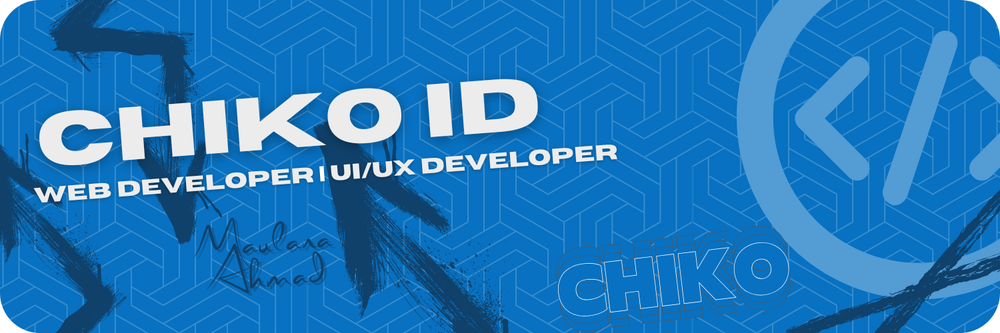

#### Haii, Saya Chiko!

Seorang programmer yang ingin fokus di dunia website.
Saya percaya kolaborasi bisa jadi kunci buat bikin solusi yang kreatif dan impactful.
Makasih udah kepo dan mampir ke profil saya, let’s connect yaa!

### Skills

  
  
  
  
  
  

 

### Connect with me
  

# My Github Stats

Hidup itu seperti coding, kadang sukses kadang juga gagal. Yang penting, jangan pernah berhenti belajar dan terus mencoba.

# Trophies

  

